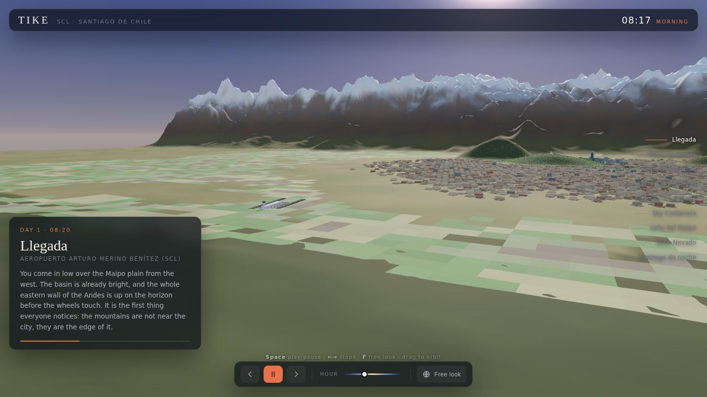
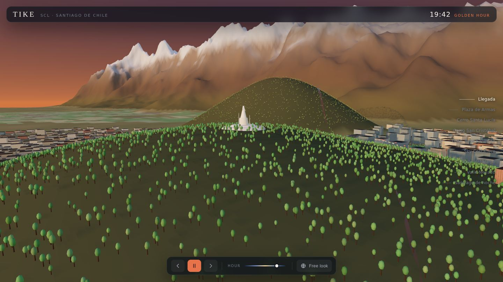
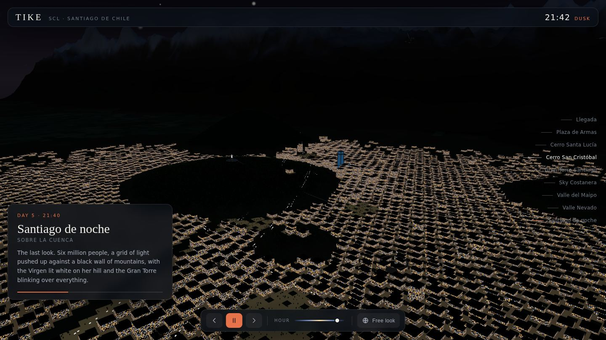
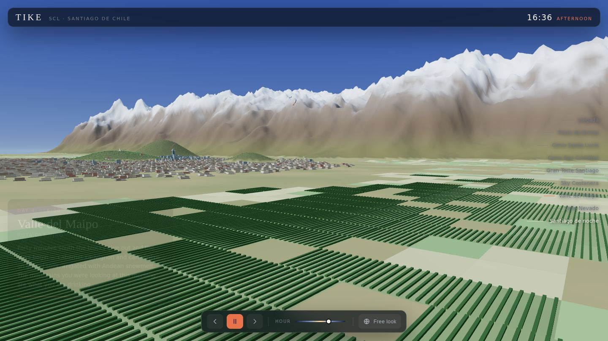

# Tike

An interactive 3D flythrough of a five-day trip to **Santiago de Chile** — the
basin, the cordillera, and nine stops across the city, each at the hour of day
you'd actually see it.



Everything you see is generated at load time from a seed. There are no models,
no textures, no map tiles and no network calls — the terrain, the street grid,
the 6 700 buildings, the 20 000 trees and the vineyards are all procedural, and
Three.js is vendored into the repo. Open `index.html` and it runs.

## Running it

Any static file server works. The page uses ES modules and an import map, so
`file://` will not do.

```sh
python3 -m http.server 8000
# then open http://localhost:8000
```

Needs a browser with WebGL 2 — every current desktop and mobile browser
qualifies. No build step, no dependencies to install.

## The itinerary

| # | Stop | Where | When |
|---|------|-------|------|
| 1 | Llegada | Aeropuerto Arturo Merino Benítez (SCL) | Day 1, 08:20 |
| 2 | Plaza de Armas | Centro Histórico | Day 1, 11:00 |
| 3 | Cerro Santa Lucía | Barrio Lastarria | Day 2, 09:40 |
| 4 | Cerro San Cristóbal | Parque Metropolitano | Day 2, 19:40 |
| 5 | Gran Torre Santiago | Sanhattan, Providencia | Day 3, 12:20 |
| 6 | Sky Costanera | Mirador, piso 61 | Day 3, 18:10 |
| 7 | Valle del Maipo | Ruta del Vino | Day 4, 16:30 |
| 8 | Valle Nevado | Cordillera de los Andes | Day 5, 10:00 |
| 9 | Santiago de noche | Sobre la cuenca | Day 5, 21:40 |

The tour plays itself. `Space` pauses, `←`/`→` step between stops, `F` hands the
camera over to you, and the **Hour** slider drags the sun anywhere in the day.



## What's modelled, and how

**The basin.** Santiago sits in a trough between the Andes and the lower
Cordillera de la Costa, and that containment explains the city's shape, its
light and its famously stubborn smog. The heightfield models both walls: ridged
fractal noise for the Andes (sharp spines, a wobbling snowline, bare rock on the
steep faces) and a softer, older range to the west. The cerros that rise out of
the street grid — San Cristóbal, Santa Lucía, Manquehue — are baked into the
same heightfield so their skirts blend instead of intersecting.

**The city.** Santiago's *damero*, the Spanish colonial checkerboard laid out in
1541, is rotated about 15° off true north. The generator works in that rotated
frame and maps into world space, which is why the whole basin reads as one
coherent grid. Density and height follow the real gradient: a dense mid-rise
centro, the glass cluster of Sanhattan where Providencia meets the river, the
Apoquindo corridor running east toward the mountains, and low sprawl out to a
noisy edge. Parks, the Mapocho's channel and the runway protection zone are
carved out as hard constraints.

**Light.** One time-of-day value in hours drives the sky gradient, the sun's
position, its colour, the fog, the star field, the window lights and the
headlights. The solar arc is tilted for 33° **south** — the sun crosses the
northern half of the sky, which is why the afternoon rakes the *west* faces of
the cordillera and why a Santiago morning looks the way it does rather than the
way a northern-hemisphere one would.

**Night.** Every building shares one canvas-generated window texture, so a
per-instance UV scale and offset is fed to the shader: the scale keeps floor
heights consistent across wildly different buildings, the offset decorrelates
which windows are lit. Without it the city reads as a tray of identical glowing
cubes.



## Liberties taken

This is a portrait, not a survey.

- **Distances are compressed.** The Andes front range is much closer to the
  centro than the ~25 km it really is, because the point of the view is that the
  mountains are the edge of the city, and true scale buries them in haze.
- **The Virgen is oversized**, roughly 1.5×, so her silhouette reads from across
  the basin instead of being a single pixel.
- **The street grid is idealised.** Real Santiago's blocks wander, especially in
  the comunas out west; here they stay regular and just thin out.
- Everything at 1 world unit = 10 metres.

Landmark proportions are honest where it matters. Gran Torre Santiago really is
300 m and really is about twice anything standing near it.



## Layout

```
index.html            page shell, import map, overlay markup
styles.css            overlay styling
src/
  main.js             renderer, scene assembly, the frame loop
  tour.js             the nine stops and the camera director
  ui.js               overlay wiring
  lib/noise.js        seeded PRNG, value noise, fBm, ridged noise
  world/
    terrain.js        heightfield, vertex colouring, snowline
    sky.js            sky shader, solar arc, the light rig
    city.js           the damero, buildings, facades, traffic
    river.js          Río Mapocho and its distance field
    landmarks.js      Gran Torre, the Virgen, the cathedral, SCL, aircraft
    nature.js         trees, farmland, vineyards, Valle Nevado
vendor/three/         Three.js r180 + OrbitControls, vendored
```

## Licence

Code: MIT. Three.js is included under its own MIT licence.
